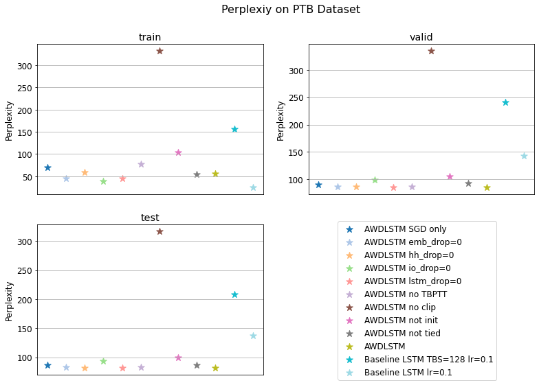

<!-- omit in toc -->
# TOC
- [Language Modelling](#language-modelling)
  - [Project description](#project-description)
  - [Results](#results)
  - [Final Mark](#final-mark)

# Language Modelling
Repository containing the results of the Natural Language Understanding course project about Language Modelling.

## Project description
The proposed task of Language Modelling (LM) for the NLU course required to:

1. implement a Language Model using one of the RNN architectures (eg. Vanilla, LSTM, GRU);
2. train it and evaluate its performance on the word-level Penn Treebank (PTB) dataset;
3. reach a baseline value of 140 PP using a Vanilla RNN, or 90.7 PP using an LSTM.

## Results
As a starting point, I decided to implement a very basic model made of:
- a neural embedding layer;
- an LSTM, to capture context information;
- a fully connected layer, for the final word prediction; and obtained 137 PP.

To improve such results, I have considered the techniques described by Merity et. al, reaching 81.43 PP.

## Final Mark
The Examination Board gave me a full mark for my project (**30 Cum Laude**).